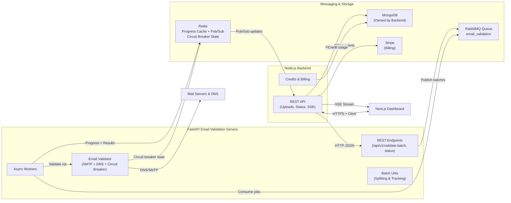

# FastAPI Email Validation Service – Overall Architecture

```mermaid
flowchart LR
    subgraph Backend["Node.js Backend"]
        API["REST API\n(Uploads, Status, SSE)"]
        Credits["Credits & Billing"]
    end

    subgraph FastAPI["FastAPI Email Validation Service"]
        Routes["REST Endpoints\n(/api/v1/validate-batch, status)"]
        BatchUtils["Batch Utils\n(Splitting & Tracking)"]
        Validator["Email Validator\n(SMTP + DNS + Circuit Breaker)"]
        Workers["Async Workers"]
    end

    subgraph Infra["Messaging & Storage"]
        RabbitMQ["RabbitMQ Queue\nemail_validation"]
        Redis["Redis\nProgress Cache + Pub/Sub\nCircuit Breaker State"]
        Mongo["MongoDB\n(Owned by Backend)"]
        Stripe["Stripe\n(Billing)"]
    end

    Frontend["Next.js Dashboard"]

    Frontend <-- "HTTPS + Clerk" --> API
    API -->|HTTP JSON| Routes
    Routes -->|Publish batches| RabbitMQ
    Workers -->|Consume jobs| RabbitMQ
    Workers -->|Progress + Results| Redis
    Redis -->|Pub/Sub updates| API
    API -->|SSE Stream| Frontend
    Workers -->|Validate via| Validator
    Validator -->|DNS/SMTP| ExternalMail["Mail Servers & DNS"]
    Validator -->|Circuit breaker state| Redis
    API -->|Final results| Mongo
    API -->|Billing events| Stripe
    Credits -->|Credit usage| Mongo
```
# FastAPI Email Validation Service – Overall Architecture

```mermaid
flowchart LR
    subgraph Backend["Node.js Backend"]
        API["REST API\n(Uploads, Status, SSE)"]
        Credits["Credits & Billing"]
    end

    subgraph FastAPI["FastAPI Email Validation Service"]
        Routes["REST Endpoints\n(/api/v1/validate-batch, status)"]
        BatchUtils["Batch Utils\n(Splitting & Tracking)"]
        Validator["Email Validator\n(SMTP + DNS + Circuit Breaker)"]
        Workers["Async Workers"]
    end

    subgraph Infra["Messaging & Storage"]
        RabbitMQ["RabbitMQ Queue\nemail_validation"]
        Redis["Redis\nProgress Cache + Pub/Sub\nCircuit Breaker State"]
        Mongo["MongoDB\n(Owned by Backend)"]
        Stripe["Stripe\n(Billing)"]
    end

    Frontend["Next.js Dashboard"]

    Frontend <-- "HTTPS + Clerk" --> API
    API -->|HTTP JSON| Routes
    Routes -->|Publish batches| RabbitMQ
    Workers -->|Consume jobs| RabbitMQ
    Workers -->|Progress + Results| Redis
    Redis -->|Pub/Sub updates| API
    API -->|SSE Stream| Frontend
    Workers -->|Validate via| Validator
    Validator -->|DNS/SMTP| ExternalMail["Mail Servers & DNS"]
    Validator -->|Circuit breaker state| Redis
    API -->|Final results| Mongo
    API -->|Billing events| Stripe
    Credits -->|Credit usage| Mongo
```

