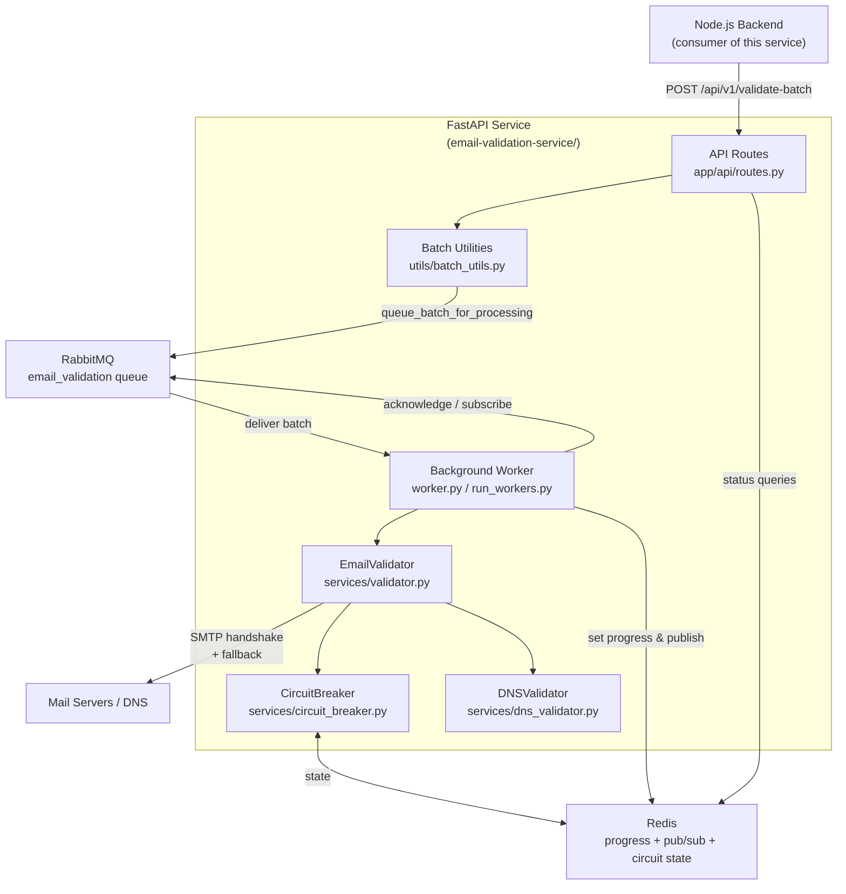
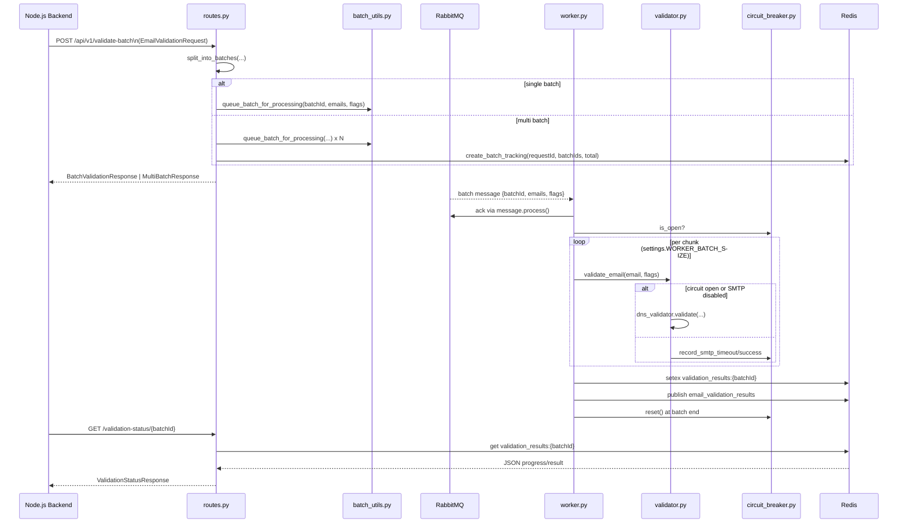

# FastAPI Email Validation Service – Architecture

This file combines the service-wide overview and the in-depth call flow for the FastAPI microservice found under `email-validation-service/`.

## 1. Top-Level Service View

## 2. Detailed Flow with Code Touchpoints

### Key Implementation Notes

- `routes.validate_batch` orchestrates batching, RabbitMQ publishing, and Redis tracking.
- `batch_utils.queue_batch_for_processing` serialises `{batchId, emails, validation_flags}` with `aio_pika.Message(..., delivery_mode=PERSISTENT)`.
- `EmailValidationWorker.process_emails` (in `worker.py`) runs chunks concurrently via `asyncio.gather`, writing progress to `validation_results:{batchId}` and publishing to the `email_validation_results` channel.
- `EmailValidator.validate_email` steps through syntax, MX, blacklist, SMTP, and catch-all checks; it consults `CircuitBreaker` (`redis` keys `smtp_consecutive_timeout_failures`, `smtp_circuit_status`, etc.).
- `DNSValidator.validate` provides DNS-only scoring when SMTP is skipped (circuit open or `check_smtp=False`).
- `routes.get_validation_status` and `routes.get_multi_validation_status` read the cached JSON directly from Redis, ensuring status calls are O(1).

This architecture depiction is current for branch `docs/wiki-documentation` after commit `0359c8f`.