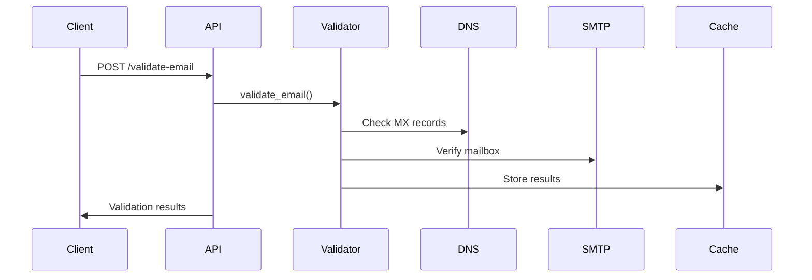
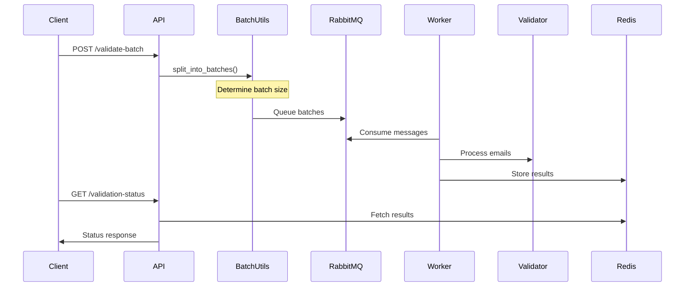
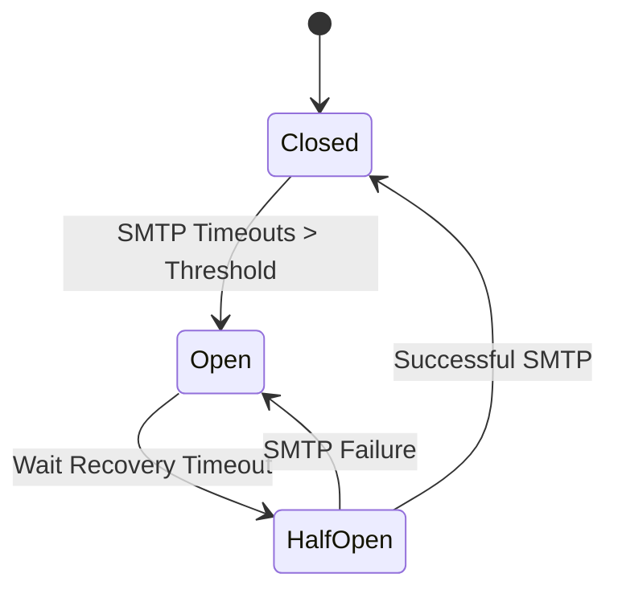

# Architecture Overview

This document explains the architecture and workflow of the Email Validation Service.

## Application Structure

```
email-validation-service/
├── app/
│   ├── api/
│   │   ├── __init__.py
│   │   └── routes.py          # API endpoints
│   ├── models/
│   │   ├── __init__.py
│   │   └── validation.py      # Pydantic models
│   ├── services/
│   │   ├── __init__.py
│   │   ├── validator.py       # Email validation logic
│   │   ├── dns_validator.py   # DNS validation
│   │   └── circuit_breaker.py # Circuit breaker implementation
│   ├── utils/
│   │   ├── __init__.py
│   │   ├── batch_utils.py     # Batch processing utilities
│   │   └── validation_constants.py # Validation rules
│   ├── __init__.py
│   └── config.py             # Application configuration
├── main.py                   # FastAPI application entry
└── run_workers.py           # Worker process management
```

## Application Startup Flow

1. **FastAPI Application Initialization** (`main.py`):
```python
app = FastAPI(
    title="Email Validation Service",
    description="API for validating email addresses",
    version="1.0.0"
)
app.include_router(routes.router, prefix=settings.API_V1_STR)
```

2. **Worker Process Initialization** (`run_workers.py`):
```python
# Starts multiple worker processes
for _ in range(settings.WORKER_COUNT):
    worker = EmailValidationWorker()
    worker.start()
```

## Core Components

### 1. Configuration Management (`config.py`)
- Environment-based configuration using pydantic-settings
- Defines timeouts, thresholds, and connection parameters
- Controls feature flags and cache settings

### 2. API Layer (`routes.py`)
- FastAPI router handling HTTP requests
- Endpoint implementations
- Request validation using Pydantic models
- Response formatting

### 3. Validation Services
- `validator.py`: Main email validation logic
- `dns_validator.py`: DNS record verification
- `circuit_breaker.py`: SMTP failure protection

### 4. Batch Processing (`batch_utils.py`)
- Batch size optimization
- Multi-batch management
- Progress tracking
- Result aggregation

## Email Validation Flow

### Single Email Validation


### Batch Processing Flow


## Batch Processing Logic

### 1. Batch Size Determination
```python
def determine_batch_size(total_emails):
    if total_emails <= 100:
        return total_emails  # Single batch
    elif total_emails <= 500:
        return 100          # 100 emails per batch
    elif total_emails <= 2000:
        return 200          # 200 emails per batch
    else:
        return 500          # 500 emails per batch
```

### 2. Processing Types

#### Small Batches (≤5 emails)
- Processed immediately in the API request
- No queueing or background processing
- Results returned directly

#### Medium Batches (≤100 emails)
- Single batch processing
- Queued to RabbitMQ
- Status tracking via batch ID

#### Large Batches (>100 emails)
- Split into multiple batches
- Parallel processing
- Progress aggregation
- Status tracking via request ID

## Worker System

### 1. Worker Initialization
```python
class EmailValidationWorker:
    def __init__(self):
        self.redis = Redis(settings.REDIS_*)
        self.rabbitmq = RabbitMQ(settings.RABBITMQ_*)
        self.validator = EmailValidator()
```

### 2. Worker Processing Flow
1. Connect to RabbitMQ
2. Subscribe to validation queue
3. Process messages in batches
4. Store results in Redis
5. Update progress tracking
6. Handle failures and retries

## Circuit Breaker Pattern

### 1. SMTP to DNS Switching


### 2. Circuit States

#### Closed (Normal Operation)
- Full SMTP validation
- Tracking timeout occurrences
- Monitoring error rates

#### Open (DNS-Only Mode)
- Skip SMTP validation
- Use DNS validation only
- Start recovery timer

#### Half-Open (Recovery)
- Test SMTP connection
- Limited validation attempts
- Ready for state transition

### 3. Threshold Management
```python
class CircuitBreaker:
    def __init__(self):
        self.failure_threshold = settings.SMTP_CIRCUIT_BREAKER_THRESHOLD
        self.recovery_timeout = settings.SMTP_CIRCUIT_BREAKER_TIMEOUT
        self.error_threshold = settings.SMTP_ERROR_THRESHOLD_PERCENTAGE
```

## Caching System

### 1. Cache Layers
- Full validation results
- MX records
- Blacklist status
- Disposable email status
- Catch-all domain status

### 2. Cache Implementation
```python
class ValidationCache:
    def __init__(self, redis_client):
        self.redis = redis_client
        self.ttls = {
            'full': settings.CACHE_TTL_FULL_RESULT,
            'mx': settings.CACHE_TTL_MX_RECORDS,
            'blacklist': settings.CACHE_TTL_BLACKLIST,
            'disposable': settings.CACHE_TTL_DISPOSABLE,
            'catch_all': settings.CACHE_TTL_CATCH_ALL
        }
```

## Performance Optimization

### 1. Parallel Processing
- Multiple worker processes
- Batch size optimization
- Connection pooling
- Result caching

### 2. Resource Management
- Connection reuse
- Proper cleanup
- Memory optimization
- Error handling

## Error Handling

### 1. Global Error Types
- Validation errors
- Connection failures
- Timeout errors
- Resource exhaustion

### 2. Recovery Mechanisms
- Automatic retries
- Circuit breaker
- Fallback strategies
- Error logging

## Monitoring and Metrics

### 1. Key Metrics
- Validation success rate
- Processing time
- Queue length
- Cache hit rate
- Error frequency

### 2. Health Checks
- Service availability
- Queue status
- Cache connectivity
- Worker health

## Deployment Considerations

### 1. Scaling
- Horizontal worker scaling
- Redis clustering
- RabbitMQ clustering
- Load balancing

### 2. High Availability
- Service redundancy
- Queue mirroring
- Cache replication
- Failover handling