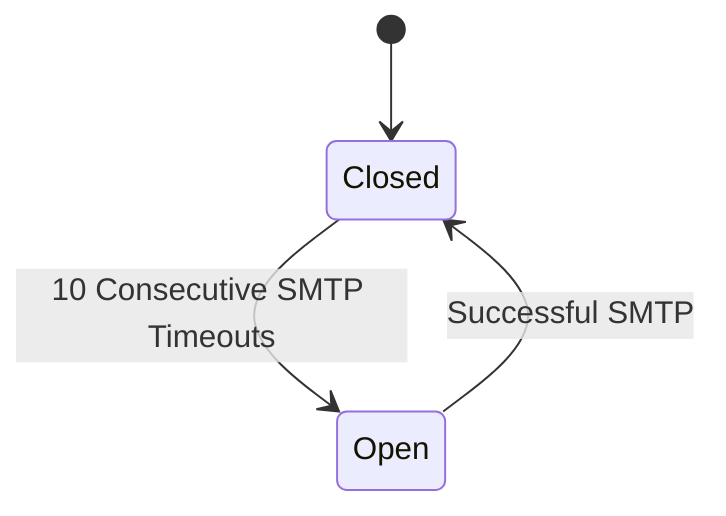

# Architecture Overview

[Previous content remains exactly the same until Circuit Breaker Pattern section]

## Circuit Breaker Pattern

### 1. SMTP to DNS Switching


### 2. Circuit States

#### Closed (Normal Operation)
- Full SMTP validation enabled
- Tracks consecutive timeout occurrences
- Opens circuit after 10 consecutive timeouts
- Resets timeout counter on successful SMTP validation

#### Open (DNS-Only Mode)
- SMTP validation disabled
- Falls back to DNS-only validation
- Returns to Closed state on successful SMTP validation
- Tracks total DNS fallbacks for monitoring

### 3. Threshold Management
```python
class CircuitBreaker:
    def __init__(self, redis_client):
        self.failure_threshold = 10  # Fixed threshold
        self.key_expiry = 3600      # State resets after 1 hour
        
        # Redis keys for state tracking
        self.consecutive_failures_key = "smtp_consecutive_timeout_failures"
        self.status_key = "smtp_circuit_status"
        self.total_dns_fallbacks_key = "smtp_total_dns_fallbacks_historical"
```

[Rest of the document remains exactly the same]