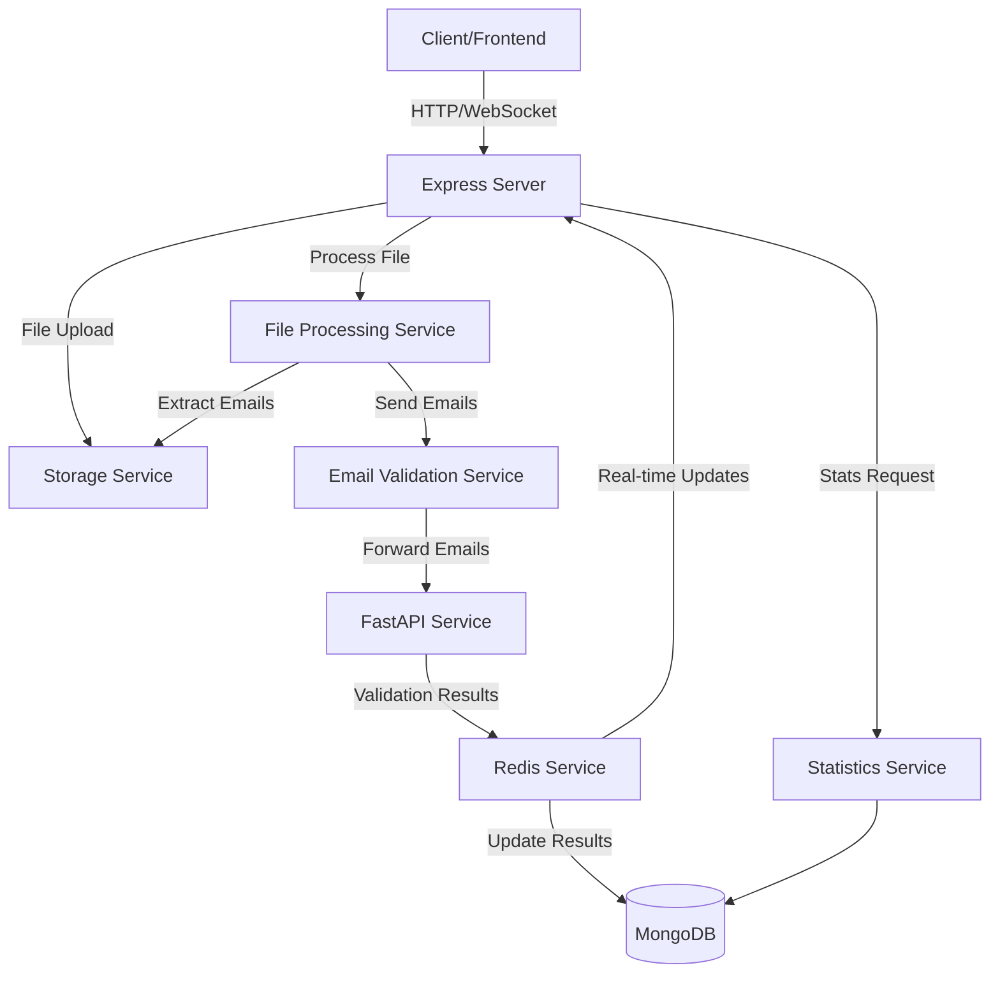

# Architecture Overview

This document provides a comprehensive overview of the Email Verification Tool's architecture, detailing how different components interact to provide email validation functionality.

## System Architecture



## Core Components

### 1. Express Application Server
- **Purpose**: Main application server handling HTTP requests and WebSocket connections
- **Key Features**:
  - RESTful API endpoints
  - File upload handling
  - Request validation
  - Error handling middleware
  - Rate limiting

### 2. Service Layer

#### Storage Service (`storageService.js`)
- **Purpose**: Manages file storage and retrieval
- **Key Features**:
  - File saving with unique identifiers
  - Secure file deletion
  - Temporary storage management
  - Support for CSV, Excel, and text files

#### File Processing Service (`fileProcessingService.js`)
- **Purpose**: Handles file parsing and email extraction
- **Key Features**:
  - Multi-format file parsing (CSV, XLSX, XLS)
  - Email extraction and validation
  - Batch creation for large files
  - Progress tracking
  - Error handling and recovery

#### Redis Service (`redisService.js`)
- **Purpose**: Manages real-time communication and caching
- **Key Features**:
  - Pub/Sub for real-time updates
  - Batch processing coordination
  - Result caching
  - Connection management (Publisher/Subscriber)
  - Error handling and retry logic

#### Email Validation Service (`emailValidationService.js`)
- **Purpose**: Interfaces with FastAPI validation service
- **Key Features**:
  - Batch validation requests
  - Result transformation
  - Error handling
  - Validation configuration

#### Statistics Service (`statisticsService.js`)
- **Purpose**: Calculates and manages validation statistics
- **Key Features**:
  - Real-time statistics calculation
  - Result aggregation
  - Progress tracking
  - Performance optimization

### 3. Data Models

#### File Model (`File.js`)
```javascript
{
    filename: String,          // Stored filename
    originalName: String,      // Original uploaded filename
    mimeType: String,         // File type
    size: Number,             // File size in bytes
    path: String,             // Storage path
    status: String,           // Processing status
    processingProgress: {
        totalRows: Number,
        processedRows: Number,
        emailsFound: Number,
        lastUpdated: Date
    }
}
```

#### Email Results Model (`EmailResults.js`)
```javascript
{
    batchId: String,          // Batch identifier
    fileId: String,           // Parent file ID
    status: String,           // Validation status
    processedEmails: Number,  // Count of processed emails
    results: [{
        email: String,
        status: String,
        is_valid: Boolean,
        risk_level: String,
        details: Object
    }]
}
```

#### Email Batches Model (`EmailBatches.js`)
```javascript
{
    fileId: String,           // Parent file ID
    totalBatches: Number,     // Total number of batches
    completedBatches: Number, // Completed batch count
    status: String           // Overall batch status
}
```

## Data Flow

### 1. File Upload Process
1. Client uploads file → Express server
2. Storage Service saves file
3. File Processing Service:
   - Parses file
   - Extracts emails
   - Creates batches
4. Redis Service coordinates batch processing
5. MongoDB stores file metadata and progress

### 2. Email Validation Flow
1. Redis Service publishes batches
2. FastAPI Service validates emails
3. Redis Service receives results
4. MongoDB stores validation results
5. Real-time updates sent to client

### 3. Statistics Generation
1. Client requests statistics
2. Statistics Service:
   - Retrieves results from MongoDB
   - Calculates metrics
   - Returns aggregated data
3. Real-time updates via Redis pub/sub

## Performance Considerations

### 1. Batch Processing
- Optimal batch size: 1000 emails
- Concurrent batch processing
- Progress tracking per batch
- Automatic retry mechanism

### 2. Database Optimization
- Indexed queries for frequent operations
- Batch updates for validation results
- Caching of frequently accessed data
- Efficient document structure

### 3. Real-time Updates
- Redis pub/sub for instant updates
- WebSocket connections for client updates
- Optimized message format
- Connection pool management

## Error Handling

### 1. File Processing Errors
- Invalid file format detection
- Corrupted file handling
- Size limit enforcement
- Progress recovery

### 2. Validation Errors
- Batch retry mechanism
- Error logging and tracking
- Graceful degradation
- Client notification

### 3. System Errors
- Connection error recovery
- Service unavailability handling
- Resource cleanup
- Error reporting

## Security Measures

### 1. File Upload Security
- File type validation
- Size restrictions
- Malware scanning (if implemented)
- Secure storage

### 2. API Security
- Rate limiting
- Input validation
- Error message sanitization
- CORS configuration

### 3. Data Security
- Temporary file cleanup
- Secure file deletion
- Data encryption (if implemented)
- Access control

## Monitoring and Logging

### 1. Application Monitoring
- Winston logger implementation
- Error tracking
- Performance metrics
- Resource utilization

### 2. Process Monitoring
- Batch processing status
- Service health checks
- Connection status
- Queue monitoring

### 3. Audit Logging
- File operations
- Validation requests
- Error occurrences
- System events

## Scalability Considerations

### 1. Horizontal Scaling
- Stateless service design
- Redis for state management
- Load balancer ready
- Service independence

### 2. Vertical Scaling
- Resource optimization
- Memory management
- Connection pooling
- Cache utilization

### 3. Future Improvements
- Microservices architecture
- Container support
- Cloud deployment
- Auto-scaling capabilities
